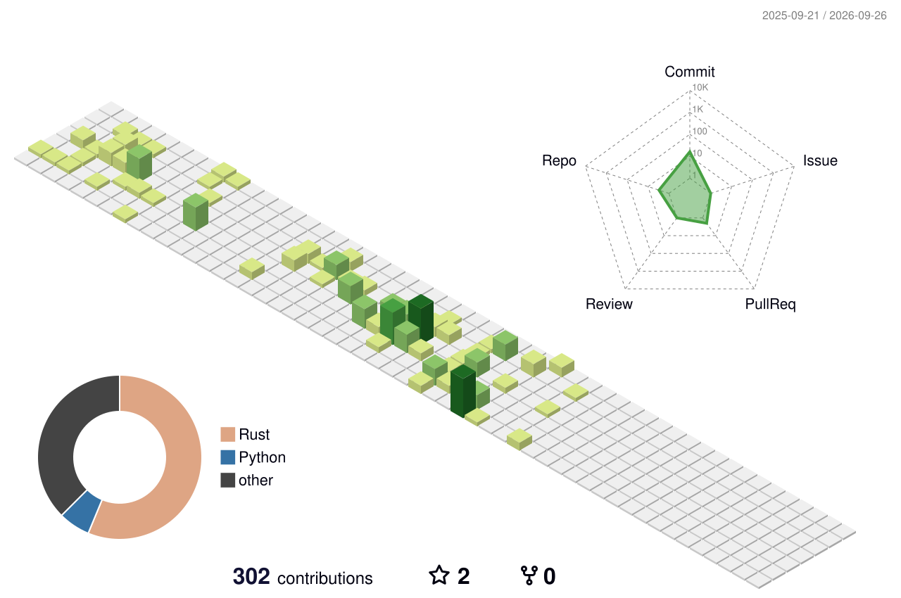

<h1 align="center">Hey, I'm Yasushiko</h1>

ME & CS student · Building things that move, think, and solve problems

  <a href="https://t.me/yasushiko">Telegram</a> ·
  <a href="https://discord.gg/HBy6jAHG3A">Discord</a> ·
  <a href="https://twitter.com/_yasushiko_">Twitter</a> ·
  <a href="https://instagram.com/_yasushiko_">Instagram</a>

---

### About Me

- Mechanical Engineering & Computer Science @ Northeastern University
- Into robotics, automation, fabrication, and building tools that do useful things
- Currently working in a university metal & wood shop, running TIG/MIG welding trainings
- I like working across the full stack, from hardware to software

### Projects

| Project | What it does | Stack |
|---------|-------------|-------|
| **[Villa Bugaz](https://www.villabugaz.com)** | Full-stack rental site for a villa business with a custom admin CMS | React, Next.js, Firebase, Resend, Cloudinary |
| **[Split The Bill](https://split-the-bill.com)** | Real-time bill splitting with live sync and QR code sharing | React, Firebase |
| **[Linky](https://github.com/YasushikoX/Linky)** | CLI tool that automates LinkedIn engagement and job applications | Rust, ChromiumOxide, Google Gemini API |
| **[Super Mailer](https://www.super-mailer.app/)** | AI-powered bulk email platform with personalized generation | React, Node.js, Supabase, Google Gemini API |
| **[Ikigai](https://github.com/YasushikoX/Ikigai)** | Discord bot for gaming matchmaking · 500+ users | Python, Discord API |
| **[Ball Buddy](https://github.com/YasushikoX/BollyBot)** | Autonomous tennis ball collection robot with computer vision | Python, 3D Printing, CAD |

### Languages & Tools

  
  
  
  
  
  
  
  
  
  
  
  

---

  

